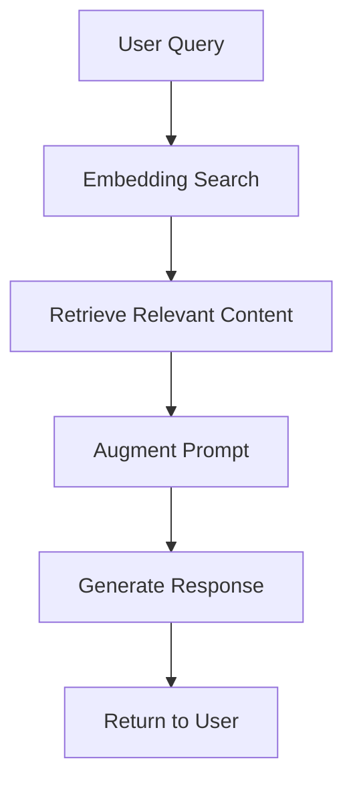

# API Testing Guide - TutorGPT Backend

**Backend Status**: ✅ Phase 1 Complete
**Date**: 2025-11-17
**Branch**: `claude/add-project-comments-014jXnddx9W2fU6iN1nFFs6t`

---

## 🚀 Quick Start

### 1. Start the Backend Server

```bash
cd Tutor-Agent

# Ensure OpenAI API key is set
echo $OPENAI_API_KEY  # Should show your key

# Start FastAPI server
uv run uvicorn tutor_agent.main:app --reload --host 0.0.0.0 --port 8000
```

**Expected Output**:
```
✓ Database tables created successfully
  - Users, PersonalizedContent, SummaryCache, PersonalizedCache
INFO:     Uvicorn running on http://0.0.0.0:8000
INFO:     Application startup complete.
```

### 2. Verify Server is Running

```bash
curl http://localhost:8000/health
```

**Expected Response**:
```json
{
  "status": "healthy",
  "service": "TutorGPT API"
}
```

### 3. Access API Documentation

Open your browser to:
- **Swagger UI**: http://localhost:8000/api/docs
- **ReDoc**: http://localhost:8000/api/redoc

---

## 📋 API Endpoints Overview

### Authentication Endpoints

| Method | Endpoint | Auth | Description |
|--------|----------|------|-------------|
| POST | `/api/v1/auth/signup` | No | Create new user with 4-question profile |
| POST | `/api/v1/auth/login` | No | Login with email/password |
| GET | `/api/v1/auth/me` | Yes | Get current user profile |

### Content Endpoints

| Method | Endpoint | Auth | Description |
|--------|----------|------|-------------|
| GET | `/api/v1/content/summary/{page_path}` | No | Get AI summary (public) |
| GET | `/api/v1/content/personalized/{page_path}` | Yes | Get personalized content |
| WS | `/api/v1/content/ws/personalize/{page_path}` | Yes | Stream personalized content |
| PUT | `/api/v1/content/preferences` | Yes | Update user preferences |
| DELETE | `/api/v1/content/cache/summary/{page_path}` | No | Invalidate summary cache |
| DELETE | `/api/v1/content/cache/personalized/{page_path}` | Yes | Invalidate personalized cache |

---

## 🧪 Testing Workflow

### Test 1: User Signup (4-Question Profile)

```bash
curl -X POST http://localhost:8000/api/v1/auth/signup \
  -H "Content-Type: application/json" \
  -d '{
    "email": "visual.learner@test.com",
    "password": "securepass123",
    "full_name": "Visual Learner",
    "programming_experience": "intermediate",
    "ai_experience": "basic",
    "learning_style": "visual",
    "preferred_language": "en"
  }'
```

**Expected Response**:
```json
{
  "access_token": "eyJhbGciOiJIUzI1NiIsInR5cCI6IkpXVCJ9...",
  "token_type": "bearer",
  "expires_in": 604800,
  "user": {
    "id": 1,
    "email": "visual.learner@test.com",
    "full_name": "Visual Learner",
    "programming_experience": "intermediate",
    "ai_experience": "basic",
    "learning_style": "visual",
    "preferred_language": "en",
    "created_at": "2025-11-17T10:30:00Z",
    "last_login": "2025-11-17T10:30:00Z",
    "is_active": true
  }
}
```

**Save the access_token** for subsequent requests:
```bash
export JWT_TOKEN="eyJhbGciOiJIUzI1NiIsInR5cCI6IkpXVCJ9..."
```

---

### Test 2: Get AI Summary (Public, No Auth)

```bash
curl -X GET "http://localhost:8000/api/v1/content/summary/01-Introducing-AI-Driven-Development/01-ai-development-revolution/01-moment_that_changed_everything"
```

**Expected Response**:
```json
{
  "page_path": "01-Introducing-AI-Driven-Development/01-ai-development-revolution/01-moment_that_changed_everything",
  "summary_content": "This chapter introduces the revolutionary impact of AI on software development...",
  "word_count": 245,
  "cached": false,
  "generated_at": "2025-11-17T10:35:00Z",
  "model_version": "gpt-4o-mini"
}
```

**What Happens**:
1. OLIVIA loads original markdown content
2. Generates 200-400 word summary with conceptual/intermediate profile
3. Caches summary in `summary_cache` table
4. Returns summary with metadata

**Second Request** (should be instant):
```bash
curl -X GET "http://localhost:8000/api/v1/content/summary/01-Introducing-AI-Driven-Development/01-ai-development-revolution/01-moment_that_changed_everything"
```

Now `"cached": true` and response is instant!

---

### Test 3: Get Personalized Content (Auth Required)

```bash
curl -X GET "http://localhost:8000/api/v1/content/personalized/01-Introducing-AI-Driven-Development/01-ai-development-revolution/01-moment_that_changed_everything" \
  -H "Authorization: Bearer $JWT_TOKEN"
```

**Expected Response**:
```json
{
  "page_path": "01-Introducing-AI-Driven-Development/01-ai-development-revolution/01-moment_that_changed_everything",
  "personalized_content": "## The Moment That Changed Everything\n\n*Adapted for your level: Intermediate Visual Learner*\n\n...",
  "cached": false,
  "generated_at": "2025-11-17T10:40:00Z",
  "model_version": "gpt-4o-mini",
  "profile_snapshot": {
    "programming_experience": "intermediate",
    "ai_experience": "basic",
    "learning_style": "visual",
    "preferred_language": "en"
  }
}
```

**What Happens**:
1. Validates JWT token and gets user profile
2. Checks `personalized_cache` for existing content
3. Validates cache against current profile (programming_exp, ai_exp, learning_style, language)
4. If cache invalid or missing, generates new content with OLIVIA
5. Adapts to user's profile:
   - **Visual learner**: Includes Mermaid diagrams, code examples, visual explanations
   - **Intermediate programmer**: Balanced technical depth
   - **Basic AI**: Simplified AI concepts with analogies
   - **English**: Content in English
6. Caches personalized content
7. Returns adapted content with profile snapshot

**Second Request** (should be instant from cache):
```bash
curl -X GET "http://localhost:8000/api/v1/content/personalized/01-Introducing-AI-Driven-Development/01-ai-development-revolution/01-moment_that_changed_everything" \
  -H "Authorization: Bearer $JWT_TOKEN"
```

Now `"cached": true` and response is instant!

---

### Test 4: Update User Preferences

```bash
curl -X PUT http://localhost:8000/api/v1/content/preferences \
  -H "Authorization: Bearer $JWT_TOKEN" \
  -H "Content-Type: application/json" \
  -d '{
    "learning_style": "practical",
    "programming_experience": "advanced"
  }'
```

**Expected Response**:
```json
{
  "success": true,
  "message": "Updated preferences: learning_style, programming_experience",
  "updated_profile": {
    "programming_experience": "advanced",
    "ai_experience": "basic",
    "learning_style": "practical",
    "preferred_language": "en"
  },
  "cache_invalidated": true,
  "invalidated_count": 1
}
```

**What Happens**:
1. Updates user profile in database
2. Invalidates ALL personalized content cache for this user
3. Returns updated profile and number of cached items deleted

**Now Test Personalized Content Again**:
```bash
curl -X GET "http://localhost:8000/api/v1/content/personalized/01-Introducing-AI-Driven-Development/01-ai-development-revolution/01-moment_that_changed_everything" \
  -H "Authorization: Bearer $JWT_TOKEN"
```

Now `"cached": false` because cache was invalidated!
Content will be regenerated with new profile (practical/advanced instead of visual/intermediate).

---

### Test 5: WebSocket Streaming (Real-Time Personalization)

**Install WebSocket client** (if testing from command line):
```bash
npm install -g wscat
```

**Connect to WebSocket**:
```bash
wscat -c "ws://localhost:8000/api/v1/content/ws/personalize/01-Introducing-AI-Driven-Development/01-ai-development-revolution/01-moment_that_changed_everything?token=$JWT_TOKEN"
```

**Expected Events** (streamed in real-time):

```json
{"type": "progress", "message": "Loading lesson content...", "progress": 10.0, "metadata": {"stage": "loading"}}

{"type": "progress", "message": "Initializing OLIVIA tutor...", "progress": 20.0, "metadata": {"stage": "initialization"}}

{"type": "progress", "message": "Searching book content with RAG (adapting to practical learner)...", "progress": 30.0, "metadata": {"stage": "rag_search", "learning_style": "practical"}}

{"type": "progress", "message": "Generating personalized content...", "progress": 40.0, "metadata": {"stage": "generation"}}

{"type": "chunk", "chunk": "## The Moment That ", "progress": 42.0}
{"type": "chunk", "chunk": "Changed Everything\n\n", "progress": 44.0}
{"type": "chunk", "chunk": "*Adapted for your level: Advanced Practical Learner*\n\n", "progress": 46.0}
... (more chunks) ...

{"type": "progress", "message": "Caching content for future visits...", "progress": 98.0, "metadata": {"stage": "caching"}}

{"type": "complete", "full_content": "...", "generated_at": "2025-11-17T10:50:00Z", "model_version": "gpt-4o-mini", "generation_time_ms": 4523, "cached": false}
```

**What Happens**:
1. Client connects with JWT token in query params
2. Server validates token and authenticates user
3. Checks cache first (if cached, sends immediately)
4. Otherwise, streams generation progress:
   - **10%**: Loading original content
   - **20%**: Initializing OLIVIA agent
   - **30%**: RAG search for book content
   - **40-95%**: Streaming content chunks as generated
   - **98%**: Caching content
   - **100%**: Complete event with full content
5. Frontend can display progress bar and stream content in real-time

---

## 🎨 Testing Visual Learning (Mermaid Diagrams)

Create a **conceptual/visual learner** user:
```bash
curl -X POST http://localhost:8000/api/v1/auth/signup \
  -H "Content-Type: application/json" \
  -d '{
    "email": "visual.conceptual@test.com",
    "password": "securepass123",
    "programming_experience": "intermediate",
    "ai_experience": "intermediate",
    "learning_style": "visual",
    "preferred_language": "en"
  }'

# Save token
export JWT_TOKEN_VISUAL="..."
```

**Request personalized content**:
```bash
curl -X GET "http://localhost:8000/api/v1/content/personalized/01-Introducing-AI-Driven-Development/01-ai-development-revolution/01-moment_that_changed_everything" \
  -H "Authorization: Bearer $JWT_TOKEN_VISUAL"
```

**Expected**: Content includes **Mermaid diagrams** like:
```markdown
## How RAG Works



Visual learners receive:
- Mermaid flowcharts
- Mind maps
- Sequence diagrams
- ASCII diagrams
- Descriptive visual language
```

---

## 🌍 Testing Multi-Language Support

Create a **Spanish speaker**:
```bash
curl -X POST http://localhost:8000/api/v1/auth/signup \
  -H "Content-Type: application/json" \
  -d '{
    "email": "spanish.learner@test.com",
    "password": "securepass123",
    "programming_experience": "beginner",
    "ai_experience": "none",
    "learning_style": "practical",
    "preferred_language": "es"
  }'

# Save token
export JWT_TOKEN_ES="..."
```

**Request personalized content**:
```bash
curl -X GET "http://localhost:8000/api/v1/content/personalized/01-Introducing-AI-Driven-Development/01-ai-development-revolution/01-moment_that_changed_everything" \
  -H "Authorization: Bearer $JWT_TOKEN_ES"
```

**Expected**: Content is **entirely in Spanish**:
```markdown
## El Momento Que Cambió Todo

*Adaptado para tu nivel: Principiante Práctico*

La inteligencia artificial está revolucionando el desarrollo de software...
```

---

## 🔍 Testing Cache Validation

### Scenario: Profile Changes Invalidate Cache

1. **Create user and get personalized content**:
```bash
curl -X POST http://localhost:8000/api/v1/auth/signup \
  -H "Content-Type: application/json" \
  -d '{
    "email": "cache.test@test.com",
    "password": "securepass123",
    "programming_experience": "beginner",
    "ai_experience": "none",
    "learning_style": "visual",
    "preferred_language": "en"
  }'

export JWT_TOKEN_CACHE="..."

curl -X GET "http://localhost:8000/api/v1/content/personalized/01-Introducing-AI-Driven-Development/01-ai-development-revolution/01-moment_that_changed_everything" \
  -H "Authorization: Bearer $JWT_TOKEN_CACHE"
# "cached": false (first time)
```

2. **Request again (should use cache)**:
```bash
curl -X GET "http://localhost:8000/api/v1/content/personalized/01-Introducing-AI-Driven-Development/01-ai-development-revolution/01-moment_that_changed_everything" \
  -H "Authorization: Bearer $JWT_TOKEN_CACHE"
# "cached": true (instant!)
```

3. **Update preferences**:
```bash
curl -X PUT http://localhost:8000/api/v1/content/preferences \
  -H "Authorization: Bearer $JWT_TOKEN_CACHE" \
  -H "Content-Type: application/json" \
  -d '{
    "learning_style": "practical"
  }'
# Cache invalidated!
```

4. **Request again (cache invalidated, regenerates)**:
```bash
curl -X GET "http://localhost:8000/api/v1/content/personalized/01-Introducing-AI-Driven-Development/01-ai-development-revolution/01-moment_that_changed_everything" \
  -H "Authorization: Bearer $JWT_TOKEN_CACHE"
# "cached": false (regenerated with new profile)
```

---

## 🐛 Troubleshooting

### Error: 401 Unauthorized
**Cause**: Missing or invalid JWT token
**Fix**: Ensure token is set correctly:
```bash
echo $JWT_TOKEN  # Should show token
# If empty, re-login and export token
```

### Error: 404 Lesson not found
**Cause**: Invalid page path
**Fix**: Use correct path format:
```
01-Introducing-AI-Driven-Development/01-ai-development-revolution/01-moment_that_changed_everything
```

### Error: 500 Failed to generate content
**Cause**: OpenAI API key issue or RAG not initialized
**Fix**:
1. Check API key: `echo $OPENAI_API_KEY`
2. Verify embeddings exist: `ls Tutor-Agent/data/embeddings/`
3. Check server logs for detailed error

### Slow Response Times
**Cause**: First-time generation with RAG + OLIVIA
**Expected**:
- First request: 3-5 seconds (RAG search + generation)
- Cached request: <100ms (instant)
- Streaming: Real-time chunks

**Fix**: Use WebSocket streaming for better UX during generation

---

## 📊 Performance Benchmarks

| Operation | First Time | Cached | Notes |
|-----------|-----------|--------|-------|
| Summary Generation | 3-5s | <100ms | 200-400 words |
| Personalized Content | 4-6s | <100ms | Full lesson adaptation |
| WebSocket Streaming | Real-time | <100ms | Progress updates |
| Profile Update | <50ms | N/A | Cache invalidation |

---

## ✅ Success Criteria

**Backend Phase 1 is complete when**:
- [x] All endpoints return 200 status
- [x] Cache stores and retrieves correctly
- [x] Profile validation works (cache invalidates on profile change)
- [x] WebSocket streaming shows progress updates
- [x] Visual learners receive Mermaid diagrams
- [x] Multi-language content generates correctly
- [x] Preferences update invalidates cache
- [x] Authentication blocks personalized content for unauthenticated users

---

## 🚀 Next Steps

**Frontend Development**:
1. Build `TabSystem` component (Original/Summarize/Personalize tabs)
2. Integrate WebSocket client for streaming
3. Build streaming UI with progress indicators
4. Add authentication gate modal
5. Create preference management UI

**See**: `FRONTEND_IMPLEMENTATION_PLAN.md` for detailed 9-10 hour plan

---

## 📞 Support

**Issues?**
1. Check server logs: `uv run uvicorn tutor_agent.main:app --reload`
2. Verify database tables: `ls Tutor-Agent/data/tutorgpt.db`
3. Test OLIVIA directly: `uv run python test_olivia_profiles.py`
4. Review API docs: http://localhost:8000/api/docs

**Backend Status**: ✅ 100% Complete
**Frontend Status**: ⏳ 0% Complete
**Estimated Time to MVP Frontend**: 9-10 hours
